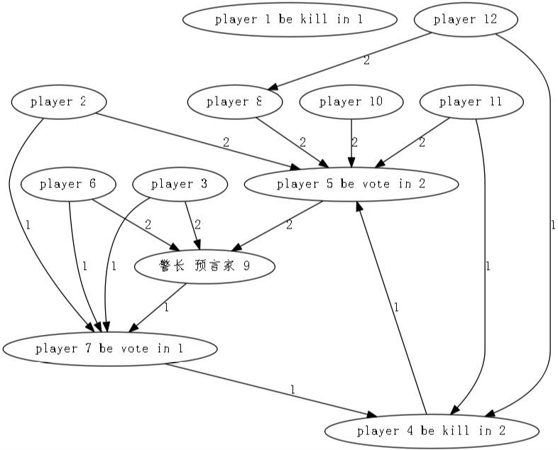
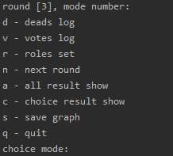

# wereWolfHelper

因为疫情缘故，最近宅家里和小伙伴们有点上瘾狼人杀（The Werewolves of Miller's Hollow），但是个人脑容量限制经常出现各种问题，弄了个狼人杀日志记录助手，目前体验非常差，因为选择完模式后还要输入各种各样的数据，接下来会尝试优化。

目前拥有功能：

+ 记录出局日志（出局玩家编号、出局类型）
+ 记录投票日志（投票指向、自动判断投票出局）
+ 记录角色日志（玩家角色编号、玩家角色类型）
+ 展示指向渲染结果

# 快速开始

### 依赖

+ python >= 3.6

进入项目目录，使用以下命令安装依赖库

```
$ pip install -r requirements.txt
```

### 使用说明

```
usage: werewolf.py [-h] [-n NUMBER]

optional arguments:
  -h, --help            show this help message and exit
  -n NUMBER, --number NUMBER
                        player number
```

# 效果图

##### 结果渲染图



##### 操作模式面板图


